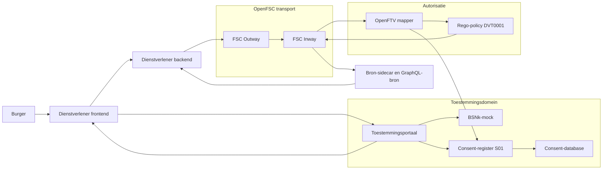
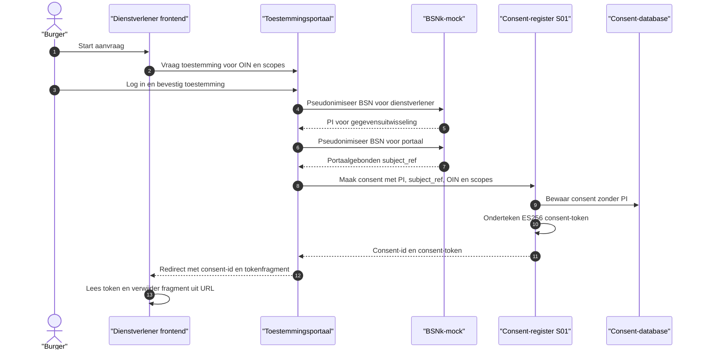
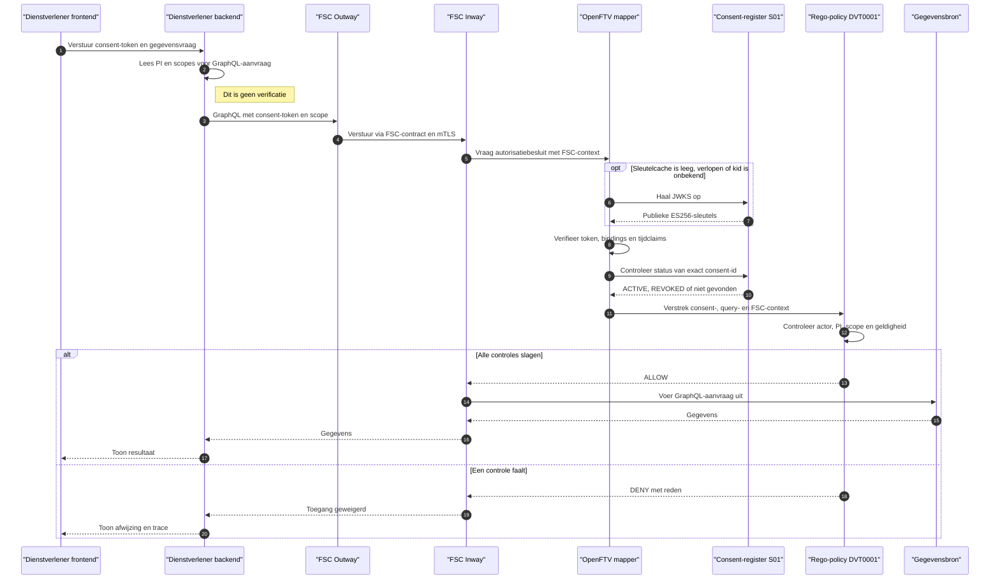
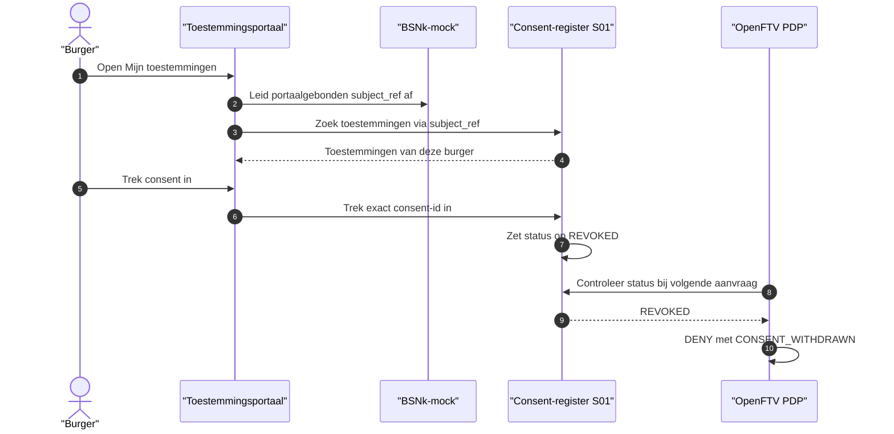

# DvTP-toestemmingsflow

Dit document beschrijft hoe een burger toestemming verleent, hoe een
dienstverlener die toestemming gebruikt en hoe intrekking onmiddellijk in het
autorisatiebesluit doorwerkt.

`S01` is de architectuurcode die in de demo voor het consent-register wordt
gebruikt. Het is geen afzonderlijke service naast het consent-register.

## Componenten



Het consent-register bewaart geen PI. De PI staat alleen in het ondertekende
consent-token en wordt tijdens het aanmaken daarvan kortstondig verwerkt. Voor
burgergerichte listing en ownership gebruikt het register een afzonderlijke,
portaalgebonden `subject_ref`.

## 1. Toestemming verlenen



Het token bevat de bindings waarop de PDP later beslist:

- `consent_id` en `jti`;
- PI, scopes en optionele veldselecties;
- `dienstverlener_oin`;
- issuer, audience en geldigheid via `iat`, `nbf`, `exp` en `valid_until`.

De bestaande API-veldnaam `dienstverlener_oin` bevat in deze flow de FSC Peer
ID waarmee de PDP de token aan `subject.id` bindt. De voorgedefinieerde
issuance-scenario's van het developer portal vullen dit veld vanuit
`DVTP_CONSUMER_PEER_ID`; alleen lokaal geldt bij ontbrekende configuratie de
default `99999999900000000300`. Handmatig ingevoerde en opgeslagen payloads
worden niet door deze configuratie overschreven.

Het portaal accepteert alleen `http`- en `https`-return-URL's waarvan de
exacte origin in `VITE_ALLOWED_RETURN_ORIGINS` staat. De token wordt in het
URL-fragment teruggegeven en direct uit de zichtbare URL verwijderd.

## 2. Toestemming gebruiken



De mapper gebruikt een JWKS-cache, vernieuwt direct bij een onbekende `kid`
en kan een bekende sleutel tijdens een korte storing begrensd stale gebruiken.
De status van het specifieke consent wordt wel bij iedere aanvraag online
gecontroleerd. JWT-tijdclaims hebben 30 seconden tolerantie voor klokverschil.

De policy geeft alleen `ALLOW` wanneer alle volgende relaties kloppen:

```text
geldige ondertekening en geregistreerde claims
+ consent bestaat, is ACTIVE en is nog geldig
+ FSC subject.id == dienstverlener_oin uit het token
+ PI in de GraphQL-query == PI uit het token
+ scope, jaren en velden vallen binnen het consent
= ALLOW
```

Ontbrekende, ongeldige of niet-beschikbare context faalt gesloten met een
gerichte reden, zoals `CONSENT_CONTEXT_INVALID`, `CONSENT_ACTOR_MISMATCH`,
`CONSTRAINT_MISMATCH`, `CONSENT_SCOPE_MISMATCH`,
`CONSENT_STATUS_UNAVAILABLE` of `CONSENT_WITHDRAWN`.

## 3. Toestemming intrekken



Een ander actief consent voor dezelfde burger kan het ingetrokken consent niet
vervangen: de PDP controleert altijd uitsluitend het `consent_id` uit het
ondertekende token.

## Beveiligingsgrens

Het demo-token is een bearer-token. De actorbinding voorkomt dat een andere
FSC-consument het token gebruikt, maar maakt replay door dezelfde consument
niet onmogelijk. Een productie-implementatie moet daarom een kortere
tokenlevensduur en proof-of-possession aan de FSC- of mTLS-identiteit toevoegen.
