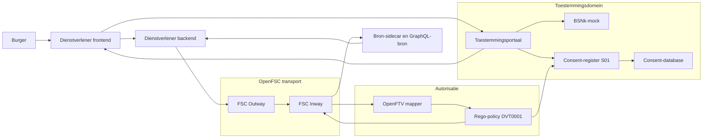
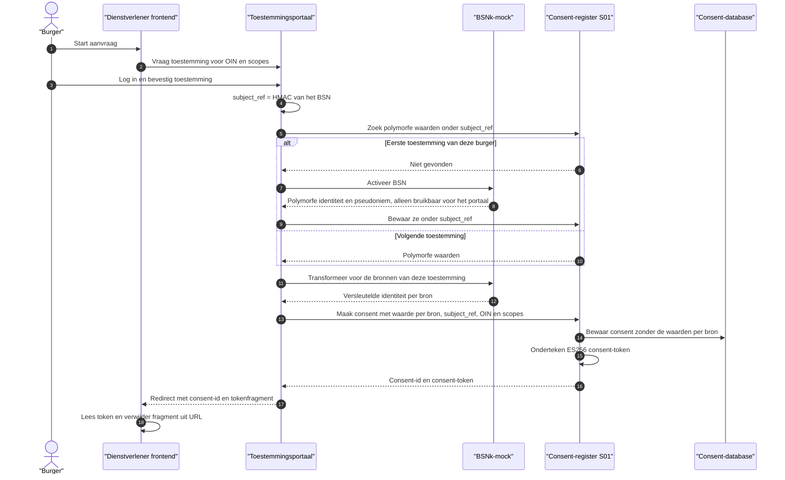
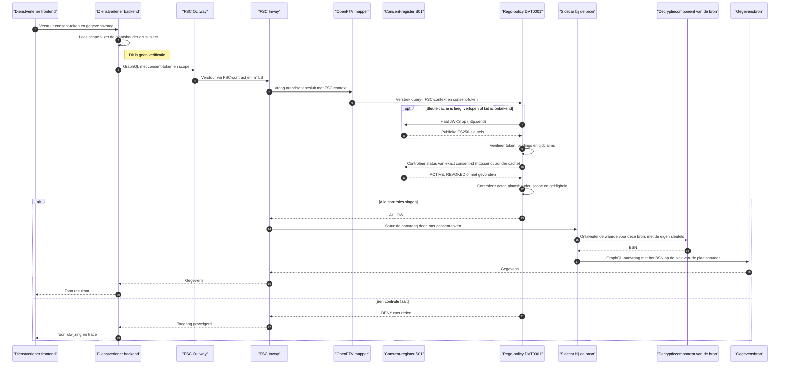
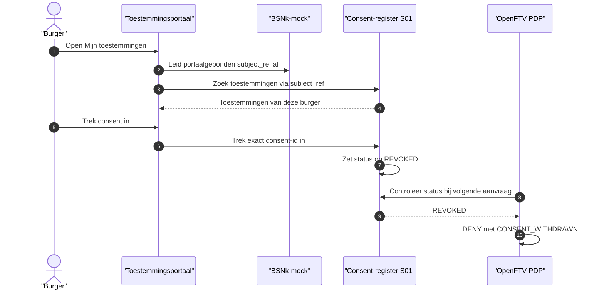

# DvTP-toestemmingsflow

Dit document beschrijft hoe een burger toestemming verleent, hoe een
dienstverlener die toestemming gebruikt en hoe intrekking onmiddellijk in het
autorisatiebesluit doorwerkt.

`S01` is de architectuurcode die in de demo voor het consent-register wordt
gebruikt. Het is geen afzonderlijke service naast het consent-register.

## Componenten


```mermaid
flowchart LR
    Citizen["Burger"]
    ConsumerUI["Dienstverlener frontend"]
    ConsumerBE["Dienstverlener backend"]

    subgraph ConsentDomain["Toestemmingsdomein"]
        Portal["Toestemmingsportaal"]
        BSNk["BSNk-mock"]
        Register["Consent-register S01"]
        ConsentDB["Consent-database"]
    end

    subgraph FSC["OpenFSC transport"]
        Outway["FSC Outway"]
        Inway["FSC Inway"]
    end

    subgraph Authorization["Autorisatie"]
        Mapper["OpenFTV mapper"]
        Policy["Rego-policy DVT0001"]
    end

    Source["Bron-sidecar en GraphQL-bron"]

    Citizen --> ConsumerUI
    ConsumerUI --> Portal
    Portal --> BSNk
    Portal --> Register
    Register --> ConsentDB
    Portal --> ConsumerUI
    ConsumerUI --> ConsumerBE
    ConsumerBE --> Outway
    Outway --> Inway
    Inway --> Mapper
    Mapper --> Policy
    Policy --> Register
    Policy --> Inway
    Inway --> Source
    Source --> ConsumerBE
```

Het consent-token noemt de burger alleen in een versleutelde identiteit per
bron: een waarde die BSNk voor het OIN van die bron maakt en die alleen die
bron kan ontsleutelen. De dienstverlener krijgt geen identificator van de
burger. Het consent-register bewaart die waarden niet; ze worden tijdens het
aanmaken van het token kortstondig verwerkt. Voor burgergerichte listing en
ownership gebruikt het register een afzonderlijke, portaalgebonden
`subject_ref`.

Die `subject_ref` leidt het portaal zelf af: een HMAC van het BSN met een
geheime sleutel van het portaal (`SUBJECT_REF_KEY`). Hetzelfde BSN geeft altijd
dezelfde verwijzing, dus het portaal vindt een burger bij elke inlog terug
zonder BSNk. Onder die verwijzing bewaart het register ook de polymorfe
waarden uit de eerste activering. Het portaal activeert een burger dus één
keer, bij de eerste toestemming; bij elke volgende toestemming laat het die
waarden alleen nog transformeren. Bekijken en intrekken roepen BSNk niet aan.

## 1. Toestemming verlenen


```mermaid
sequenceDiagram
    autonumber
    actor Citizen as "Burger"
    participant UI as "Dienstverlener frontend"
    participant Portal as "Toestemmingsportaal"
    participant BSNk as "BSNk-mock"
    participant Register as "Consent-register S01"
    participant DB as "Consent-database"

    Citizen->>UI: Start aanvraag
    UI->>Portal: Vraag toestemming voor OIN en scopes
    Citizen->>Portal: Log in en bevestig toestemming

    Portal->>Portal: subject_ref = HMAC van het BSN
    Portal->>Register: Zoek polymorfe waarden onder subject_ref
    alt Eerste toestemming van deze burger
        Register-->>Portal: Niet gevonden
        Portal->>BSNk: Activeer BSN
        BSNk-->>Portal: Polymorfe identiteit en pseudoniem, alleen bruikbaar voor het portaal
        Portal->>Register: Bewaar ze onder subject_ref
    else Volgende toestemming
        Register-->>Portal: Polymorfe waarden
    end
    Portal->>BSNk: Transformeer voor de bronnen van deze toestemming
    BSNk-->>Portal: Versleutelde identiteit per bron

    Portal->>Register: Maak consent met waarde per bron, subject_ref, OIN en scopes
    Register->>DB: Bewaar consent zonder de waarden per bron
    Register->>Register: Onderteken ES256 consent-token
    Register-->>Portal: Consent-id en consent-token

    Portal-->>UI: Redirect met consent-id en tokenfragment
    UI->>UI: Lees token en verwijder fragment uit URL
```

Het token bevat de bindings waarop de PDP later beslist:

- `consent_id` en `jti`;
- `encrypted_subject`: per bron het OIN, de sleutelversie en de versleutelde
  identiteit;
- scopes en optionele veldselecties;
- `dienstverlener_oin`;
- issuer, audience en geldigheid via `iat`, `nbf`, `exp` en `valid_until`.

De bestaande API-veldnaam `dienstverlener_oin` bevat in deze flow de FSC Peer
ID waarmee de PDP de token aan `subject.id` bindt, of, als een integrator
namens de dienstverlener verbindt, aan de delegator uit de FSC-verbinding (zie
[Integrator namens een dienstverlener](integrator.md)). De voorgedefinieerde
issuance-scenario's van het developer portal vullen dit veld vanuit
`DVTP_CONSUMER_PEER_ID`; alleen lokaal geldt bij ontbrekende configuratie de
default `99999999900000000300`. Handmatig ingevoerde en opgeslagen payloads
worden niet door deze configuratie overschreven.

Het portaal accepteert alleen `http`- en `https`-return-URL's waarvan de
exacte origin in `VITE_ALLOWED_RETURN_ORIGINS` staat. De token wordt in het
URL-fragment teruggegeven en direct uit de zichtbare URL verwijderd.

## 2. Toestemming gebruiken


```mermaid
sequenceDiagram
    autonumber
    participant UI as "Dienstverlener frontend"
    participant BE as "Dienstverlener backend"
    participant OUT as "FSC Outway"
    participant IN as "FSC Inway"
    participant MAP as "OpenFTV mapper"
    participant Register as "Consent-register S01"
    participant POL as "Rego-policy DVT0001"
    participant SC as "Sidecar bij de bron"
    participant DEC as "Decryptiecomponent van de bron"
    participant SRC as "Gegevensbron"

    UI->>BE: Verstuur consent-token en gegevensvraag
    BE->>BE: Lees scopes, zet de plaatshouder als subject
    Note right of BE: Dit is geen verificatie

    BE->>OUT: GraphQL met consent-token en scope
    OUT->>IN: Verstuur via FSC-contract en mTLS
    IN->>MAP: Vraag autorisatiebesluit met FSC-context
    MAP->>POL: Verstrek query-, FSC-context en consent-token

    opt Sleutelcache is leeg, verlopen of kid is onbekend
        POL->>Register: Haal JWKS op (http.send)
        Register-->>POL: Publieke ES256-sleutels
    end
    POL->>POL: Verifieer token, bindings en tijdclaims

    POL->>Register: Controleer status van exact consent-id (http.send, zonder cache)
    Register-->>POL: ACTIVE, REVOKED of niet gevonden

    POL->>POL: Controleer actor, plaatshouder, scope en geldigheid

    alt Alle controles slagen
        POL-->>IN: ALLOW
        IN->>SC: Stuur de aanvraag door, met consent-token
        SC->>DEC: Ontsleutel de waarde voor deze bron, met de eigen sleutels
        DEC-->>SC: BSN
        SC->>SRC: GraphQL-aanvraag met het BSN op de plek van de plaatshouder
        SRC-->>IN: Gegevens
        IN-->>BE: Gegevens
        BE-->>UI: Toon resultaat
    else Een controle faalt
        POL-->>IN: DENY met reden
        IN-->>BE: Toegang geweigerd
        BE-->>UI: Toon afwijzing en trace
    end
```

De policy haalt het consent zelf op, tijdens de evaluatie (`http.send` vanuit
`policies/dvtp/gbo/consent.rego`); de mapper verifieert en raadpleegt niets.
De JWKS wordt vijf minuten gecachet en direct opnieuw opgehaald bij een
onbekende `kid`. De status van het specifieke consent wordt bij iedere aanvraag
zonder cache online gecontroleerd, zodat een intrekking bij de eerstvolgende
aanvraag doorwerkt. JWT-tijdclaims hebben 30 seconden tolerantie voor
klokverschil. Elke aanroep heeft een timeout van twee seconden; een
onbereikbaar register levert een expliciete weigering op, geen ongedefinieerde
regel.

De policy geeft alleen `ALLOW` wanneer alle volgende relaties kloppen:

```text
geldige ondertekening en geregistreerde claims
+ consent bestaat, is ACTIVE en is nog geldig
+ FSC-delegator (anders subject.id) == dienstverlener_oin uit het token
+ bij delegatie: integrator gemandateerd voor die dienstverlener en regel
+ het subject in de GraphQL-query is de plaatshouder `consent:subject`
+ scope, jaren en velden vallen binnen het consent
= ALLOW
```

De dienstverlener noemt het subject met de plaatshouder en niet met een eigen
waarde: het subject kan zo alleen de burger van het geverifieerde consent
zijn. Pas na de `ALLOW` zet de sidecar bij de bron het BSN op de plek van de
plaatshouder. De bron ontsleutelt daarvoor zelf de waarde die het token voor
haar OIN draagt, met sleutels die ze vooraf heeft gekregen en zonder BSNk aan
te roepen. Een waarde die voor een andere partij is gemaakt, accepteert de
bron niet. Een aanvraag zonder consent-token (de EUDI-route) gaat ongewijzigd
door.

Dat de vervanging pas na de beslissing komt, hangt eraan dat alleen de Inway
de sidecar kan bereiken. In de demo zit de sidecar daarom alleen op een
netwerk met de Inways van de bronnen (`source-gateways`) en op een netwerk met
wat de bron bedient (`sources`), en publiceert hij geen poort. Een afnemer die
de sidecar rechtstreeks zou bereiken, sloeg de PDP over.

Ontbrekende, ongeldige of niet-beschikbare context faalt gesloten met een
gerichte reden, zoals `CONSENT_SIGNATURE_INVALID`, `CONSENT_TOKEN_EXPIRED`,
`CONSENT_CONTEXT_INVALID`, `CONSENT_KEYS_UNAVAILABLE`,
`CONSENT_ACTOR_MISMATCH`, `INTEGRATOR_NOT_REGISTERED`, `CONSTRAINT_MISMATCH`,
`CONSENT_SCOPE_MISMATCH`,
`CONSENT_STATUS_UNAVAILABLE` of `CONSENT_WITHDRAWN`.

## 3. Toestemming intrekken


```mermaid
sequenceDiagram
    autonumber
    actor Citizen as "Burger"
    participant Portal as "Toestemmingsportaal"
    participant BSNk as "BSNk-mock"
    participant Register as "Consent-register S01"
    participant PDP as "OpenFTV PDP"

    Citizen->>Portal: Open Mijn toestemmingen
    Portal->>BSNk: Leid portaalgebonden subject_ref af
    Portal->>Register: Zoek toestemmingen via subject_ref
    Register-->>Portal: Toestemmingen van deze burger

    Citizen->>Portal: Trek consent in
    Portal->>Register: Trek exact consent-id in
    Register->>Register: Zet status op REVOKED

    PDP->>Register: Controleer status bij volgende aanvraag
    Register-->>PDP: REVOKED
    PDP->>PDP: DENY met CONSENT_WITHDRAWN
```

Een ander actief consent voor dezelfde burger kan het ingetrokken consent niet
vervangen: de PDP controleert altijd uitsluitend het `consent_id` uit het
ondertekende token.

## Beveiligingsgrens

Het demo-token is een bearer-token. De actorbinding voorkomt dat een andere
FSC-consument het token gebruikt, maar maakt replay door dezelfde consument
niet onmogelijk. Een productie-implementatie moet daarom een kortere
tokenlevensduur en proof-of-possession aan de FSC- of mTLS-identiteit toevoegen.
