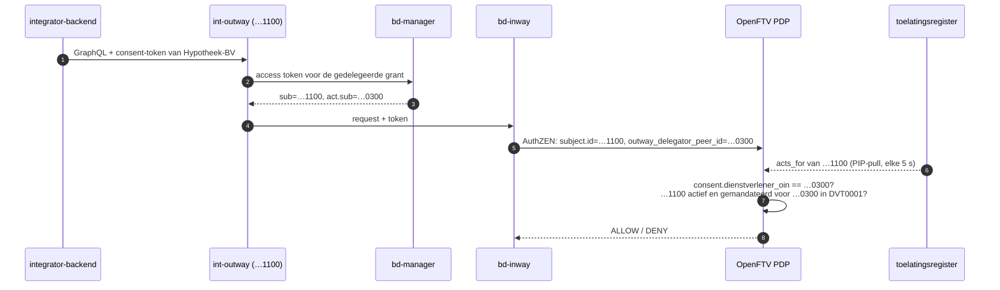

# Integrator namens een dienstverlener

Dit document beschrijft hoe de demo een integrator laat bevragen namens een
dienstverlener. Het is de bestaande
[DvTP-toestemmingsflow](consent-flow.md), met één verschil: niet de peer van
de dienstverlener verbindt met de bron, maar die van een softwarepartij die in
opdracht van de dienstverlener werkt.

De functionele eisen voor DvTP behandelen zo'n integrator als verwerker van de
dienstverlener: hij mag de gegevens inzien en omzetten voor zover de opdracht
vraagt, zonder ze te bewaren, en hij wordt als eigen deelnemer toegelaten, per
dienstverlener en use case. De burger hoeft de integrator niet te zien; het
toestemmingsportaal toont hem daarom niet meer.

## Componenten

| Component | Rol |
|---|---|
| integrator-peer `…1100` | eigen FSC-deelnemer (`int-*` in `fsc-infra`), met alleen een Outway |
| `integrator-backend` (9423) | `dienstverlener-backend` via `int-outway`: dezelfde inkomensvraag, met het consent van Hypotheek-BV |
| DelegatedServiceConnectionGrant | contract tussen integrator (delegatee), Hypotheek-BV (delegator) en BD (bron) |
| DvTP-toelatingsregister | `integrations`: integrator `…1100` handelt voor `…0300` in `DVT0001` |
| policy | consent aan de vertegenwoordigde partij, mandaat voor de handelende partij |

## Flow



## Consequenties

### 1. Consentbinding

`dienstverlener_oin` wordt vergeleken met de **vertegenwoordigde** partij: de
delegator uit de gedelegeerde verbinding, en bij een directe aanroep
`subject.id` zoals voorheen. De integrator komt aan zijn bevoegdheid via een
eigen mandaat, niet via het consent: een aparte stap
(`INTEGRATOR_NOT_REGISTERED`) eist dat de verbindende peer in het
toelatingsregister actief is en voor die dienstverlener en die regel mag
handelen. Een gedelegeerde aanroep zonder mandaat faalt op die stap, ook bij
regels zonder consent. De binding wordt dus niet opgerekt: een integrator kan
geen consent gebruiken dat aan een andere dienstverlener of aan hemzelf is
gegeven (`CONSENT_ACTOR_MISMATCH`).

OpenFSC vult de claims anders dan de FSC-spec doet vermoeden. De
Manager van de bron (v2.4.0, `get_token_info.sql`) zet de **delegator** in
`act.sub` en de verbindende peer in `sub`. Dat is het omgekeerde van RFC 8693,
waar `act` de handelende partij noemt. De policy leest de claim niet zelf maar
het AuthZEN-veld dat de Inway ervan maakt,
`subject.attributes.outway_delegator_peer_id`. Die naam zegt wat het is, en
blijft kloppen als OpenFSC de claim later rechttrekt.

Het token is ondertekend door de Manager van de bron zelf, op basis van een
contract dat alle drie de partijen tekenden. De delegator is daarmee net zo
betrouwbaar als `subject.id`.

### 2. Autorisatie-input

Ja. De Inway geeft de hele tokeninhoud door als `subject.properties`, en
OpenFTV zet die in OPA-input onder `input.subject.attributes`: de delegator,
maar ook `service_name`, `grant_hash` en `service_peer_id`. De policy leest de
twee rollen apart:

- `acting_party(ctx)`: `subject.id`, de peer die verbindt;
- `represented_party(ctx)`: de delegator, of `subject.id` bij een directe
  aanroep.

Een delegator die gelijk is aan de verbindende peer telt als directe aanroep.
`allowed_actors` (EUDI-regels) blijft de verbindende peer controleren.
Weglaten van het consent-token helpt een integrator dus niet: dan valt hij
onder het PID-regime en daar staat hij niet in `allowed_actors`.

### 3. Toelating

Deels, en wel voldoende. Een gedelegeerd contract komt bij de autosign van de
bron binnen met drie peer-ID's en `grant_types: [3]`, zonder grantdata.
`policies/fsc/autosign.rego` laat `delegatedServiceConnection` nu toe als:

- beide tegenpartijen elk zelf toegelaten, actief en voor deze bron
  geregistreerd zijn, net als bij een gewone verbinding;
- er precies twee tegenpartijen zijn en één daarvan in het register voor de
  andere mag handelen; anders `DELEGATION_NOT_REGISTERED`.

Welke van de twee de delegator is, ziet de autosign niet. Een contract dat
andersom is getekend (Hypotheek-BV als delegatee namens de integrator) wordt
dus toegelaten. Bij de eerste aanroep weigert de policy het alsnog, omdat de
richting dan wél in het token staat. Toelating per dienst of use case kan pas
als OpenFSC de grantdata in de autosign-input meestuurt.

### 4. Registratie in de catalogus

In het **DvTP-toelatingsregister**, als `integrations` in de
deploymentconfiguratie:

```json
{"integrator_peer_id": "99999999900000001100",
 "service_provider_peer_id": "99999999900000000300",
 "rules": ["DVT0001"]}
```

De use case is de policyregel. Dat past bij het model van de engine, waarin
de regel de catalogus is ("model C"). Het register levert elke integratie aan
OpenFTV als `acts_for` op de entry van de integrator. De autosign en de
request-policy lezen hetzelfde feed.

Het contract alleen is niet genoeg. Het zegt dat drie partijen mogen
verbinden, maar niet voor welke regel, en het blijft geldig nadat een
integrator is geschorst. Het register wordt per aanroep gelezen: schorsen of
een mandaat intrekken werkt binnen één PIP-interval.

De integratie staat nog in configuratie en niet in de beheer-UI. Dat is
bewust klein gehouden. Een integratie laat ook niemand toe: integrator en
dienstverlener hebben elk een eigen actieve entry nodig.

### 5. Logging

- **LDV bij de bron:** `bron-sidecar` en `graphql-server` leggen de
  integrator vast als `foreignOperation.processor`
  (`https://fsc.gbo.overheid.nl/peers/…1100`), want `ForeignProcessor` leest
  `sub`. De dienstverlener staat níet in het record; LDV heeft geen veld voor
  "namens".
- **LDV bij de afnemer:** `integrator-backend` schrijft in het logboek van
  Hypotheek-BV, met `nextLogbookId` naar de bron. De verwerkingsverantwoordelijke
  is dus Hypotheek-BV; de integrator bewaart zelf niets.
- **FSC-transactielog van de bron:** legt beide rollen vast,
  `delegated_src_outway_peer_id=…1100` en
  `delegated_src_delegator_peer_id=…0300`.
- **ADL:** de AuthZEN-request, inclusief `subject.attributes`, en dus ook de
  delegator.

Wie aan de bronkant wil weten namens wie een verwerker vroeg, vindt dat via
de FSC-transactielog of de trace naar het logboek van de afnemer, niet in het
eigen LDV-record. Als dat eigen record het moet tonen, is het een aanpassing
in `ldv-client` (bijvoorbeeld `act.sub` meenemen) en een vraag voor de
LDV-standaard.

## Upstream-bevindingen

- **Autosign zonder grantdata:** de autosign-input heeft geen grantdata, dus geen richting van de
  delegatie en geen dienst.
- **`act.sub` is de delegator:** OpenFSC wijkt af van RFC 8693. Voor de demo
  maakt dat niet uit (zie vraag 1), maar het verdient een issue bij OpenFSC.
- **Delegator tekent handmatig:** de Manager van Hypotheek-BV heeft geen
  autosign. `seed-bri-delegation-int.sh` accepteert het contract namens
  Hypotheek-BV, zoals de beheerder dat in de Controller-UI zou doen.
- **Reden ontbreekt in de 401:** de Inway geeft de weigeringsreden nog niet
  door. Zie de ADL of de PDP-console voor de code.

## Lokaal testen

`make demo-dvtp` en `make demo-full` maken de integrator-peer aan en seeden
het gedelegeerde contract (`make fsc-seed-int`). Geef daarna consent aan
Hypotheek-BV (`…0300`) en stuur de query naar `integrator-backend`:

```bash
login=$(curl -sS -X POST localhost:9405/portal/login \
  -H 'Content-Type: application/json' -d '{"citizen_bsn":"123456789"}' | jq -r .token)
token=$(curl -sS -X POST localhost:9405/portal/consents \
  -H "Authorization: Bearer $login" -H 'Content-Type: application/json' \
  -d '{"dienstverlener_oin":"99999999900000000300","scopes":["bd:ib:2025"],"validity_seconds":3600}' \
  | jq -r .consent_token)
curl -sS -X POST localhost:9423/api/dvtp/query \
  -H 'Content-Type: application/json' \
  -d "{\"consent_token\":\"$token\",\"belastingjaren\":[2025]}"
```

| Situatie | Uitkomst |
|---|---|
| consent aan Hypotheek-BV, integrator gemandateerd voor DVT0001 | ALLOW |
| consent aan een andere dienstverlener | `CONSENT_ACTOR_MISMATCH` |
| integrator alleen gemandateerd voor LVG0001 | `INTEGRATOR_NOT_REGISTERED` |
| geen integratie in het register | `INTEGRATOR_NOT_REGISTERED`; een nieuw gedelegeerd contract blijft `proposed` met `DELEGATION_NOT_REGISTERED` |

De policytests dekken dezelfde gevallen voor directe en gedelegeerde
aanroepen (`dvt0001_test.rego`, `engine_test.rego`, `autosign_test.rego`).
