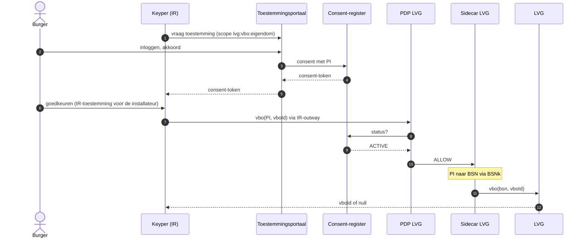

# LVG / Installatie Register

Dit document beschrijft hoe de demo de pilot van de Landelijke Voorziening
Gebouwen (LVG) en het Installatie Register (IR) naspeelt. Het is de bestaande
[DvTP-toestemmingsflow](consent-flow.md) met een andere afnemer en bron: er is
geen nieuw consentpatroon.

## Twee toestemmingen

| Toestemming | Wie aan wie | Waar vastgelegd | In GBO |
|---|---|---|---|
| Eigendomscheck | burger → IR: mag bij LVG controleren of een pand van de burger is | consent-register (DvTP) | ja |
| Inzage | burger → installateur: mag de gegevens van dit pand in IR inzien | Installatie Register | nee, mock in `keyper-mock` |

De burger geeft beide toestemmingen na elkaar: eerst in MijnOverheid, en
direct daarna in IR. Pas als beide er zijn, vraagt IR LVG naar het eigendom;
alleen bij een bevestiging legt IR de toegang voor de installateur vast.

## Componenten

| Component | Rol |
|---|---|
| `keyper-mock` (9004) | IR/Keyper: aanvraag installateur, goedkeuring eigenaar, installatiegegevens |
| `ir-backend` (9410) | `dienstverlener-backend` met `QUERY_KIND=lvg`: stelt de eigendomsvraag via FSC |
| IR-peer `…1000` | eigen FSC-afnemer (`ir-*` in `fsc-infra`), zodat de actorbinding IR onderscheidt |
| service `lvg` | extra logische bron op de gedeelde provider-peer `…0200`, achter `bd-inway`, zoals RvIG |
| `lvg-sidecar` (9412) | `bron-sidecar`: PI → BSN |
| `lvg-graphql-server` (9408) | mock-LVG: `vbo(bsn, vboId) { vboId }` |
| `LVG0001` | policy-regel: dezelfde consentcontroles als DVT0001, scope vastgepind op `lvg:vbo:eigendom` |
| `logboek-lvg` (9421) | Logboek Dataverwerkingen van LVG: PI-resolutie, doorgifte en de eigendomscheck |
| `logboek-ir` (9422) | Logboek Dataverwerkingen van IR als afnemer, met `nextLogbookId` naar LVG |

## Flow



IR bewaart het consent-token en stelt bij elke opvraging door de installateur
dezelfde vraag opnieuw. Trekt de burger de toestemming in MijnOverheid in, dan
weigert de PDP die herhaalde vraag en geeft IR niets vrij.

De drie uitkomsten:

| Antwoord | Betekenis voor IR |
|---|---|
| het gevraagde VBO-id | eigendom bevestigd |
| `null` | burger is geen eigenaar van dit pand |
| weigering door de PDP | geen geldige toestemming; eigendom niet bevestigd |

## Logboek Dataverwerkingen

Elke eigendomsvraag laat onder één trace records achter bij twee
Verantwoordelijken:

| Logboek | Verwerkingsactiviteit | Door |
|---|---|---|
| IR | `ir-eigendom-controleren` | `ir-backend`, met `nextLogbookId` naar LVG |
| LVG | `lvg-pi-bsn-resolutie` | `lvg-sidecar`, met doorverwijzing naar BSNk |
| LVG | `lvg-bronquery-doorgifte` | `lvg-sidecar` |
| LVG | `lvg-vbo-eigendom` | `lvg-graphql-server`, ook als het antwoord `null` is |

Een vraag die de PDP weigert, bereikt LVG niet en staat alleen in het logboek
van IR. Het developer-portal volgt de keten via `nextLogbookId`.

## Developer-portal

De scope bepaalt de afnemer: `lvg:*` gaat naar het Installatie Register
(peer `…1000`, `ir-backend`), elke andere scope naar Hypotheek-BV. Scenario's:
`issuance-lvg-eigendom`, `use-lvg-eigenaar-allow` en
`use-lvg-geen-eigenaar-allow`.

## Afwijkingen van het interactiediagram van de pilot

- De burger gaat vanuit Keyper rechtstreeks naar MijnOverheid, niet via LVG.
- MijnOverheid (DvTP) controleert de toestemming; LVG zoekt het VBO-id op en
  vergelijkt. De eigendomscontrole hoort niet bij MijnOverheid.

## Demo

```bash
make demo-dvtp
```

Open het Installatie Register op <http://localhost:9004> en log in het portaal
in met BSN `123456789`; die burger bezit `0632010000099412` (Meidoornhof 12).
BSN `987654321` bezit `0632010000099413` en is dus geen eigenaar van
Meidoornhof 12.

## Open punten

- Met één toestemming kan IR voor elk VBO-id vragen of de burger eigenaar is.
  Of het VBO-id in de toestemming zelf moet staan, ligt bij de pilot.
- In de simulatieomgeving heeft IR een eigen afnemer-peer van het platform
  nodig; tot die er is draait deze flow alleen lokaal.
