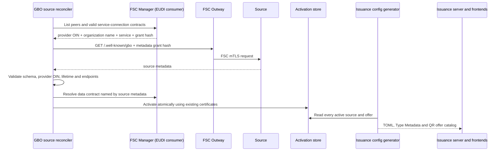

# Bronnen ontdekken en activeren

GBO configureert geen bronquery of mapping. Een bron publiceert één generiek
document op `/.well-known/gbo`. De EUDI-capability daarin bevat per type de
GraphQL-service, query, parameters, concrete aanbiedingen (`offers`), mapping
en wallet Type Metadata. Later kan hetzelfde document naast
`capabilities.eudi` bijvoorbeeld `capabilities.oots` bevatten.

Een offer is een concreet product dat de wallet kan aanbieden. Het heeft een
stabiele id en vult uitsluitend parameters in die bij de query zijn
gedeclareerd, bijvoorbeeld `jaar: 2024`. De adapter accepteert alleen exact
zo'n gepubliceerde parametercombinatie. Dat is inputbegrenzing, geen
autorisatieverlening: de PDP beoordeelt de gekozen velden en parameterwaarden
opnieuw bij ieder gebruik.

## FSC: geen onboardingbestand

Voor een FSC-bron zijn twee geldige service-connection-contracten nodig:

- `gbo-metadata`, om het vaste `/.well-known/gbo`-document op te halen;
- de dataservice die het brondocument zelf noemt, bijvoorbeeld `bri` of `brp`.

De reconciler leest de contracten uit de FSC Manager van de EUDI-adapterpeer.
Per contract gebruikt hij de provider-OIN, servicenaam en grant-hash. De
organisatienaam komt uit de peerregistratie van dezelfde FSC Manager. Daardoor
staan bronidentiteit, FSC-servicebindingen en grant-hashes niet ook nog in Git
of in losse onboarding-YAML.

De statische `validate-source`- en `onboard-source`-commando's weigeren daarom
het FSC-transport en verwijzen naar `reconcile-fsc-sources`.



De provider-OIN uit het metadata-document moet gelijk zijn aan de provider-OIN
in het FSC-contract. Metadata en data moeten voor diezelfde provider geldige
contracten hebben. De issuance-runtime leest alleen geactiveerde records en
stuurt bij ieder FSC-verzoek de gepinde grant-hash mee. Zonder geldig record of
bruikbaar contract faalt uitgifte gesloten; er is geen legacyfallback.

## Wat staat waar?

| Gegeven | Bron |
|---|---|
| Provider-OIN, transportbinding en grant-hash | geldig FSC-contract |
| Organisatienaam van de bron | FSC-peerregistratie voor hetzelfde provider-OIN |
| Vast metadata-pad | GBO-profiel: `/.well-known/gbo` |
| Dataservicenaam, GraphQL-endpoint, query, parameters, offers en mapping | bronmetadata |
| Kaartnaam, kaartkleur, kaartlogo, claimlabels en claimschema | Type Metadata in de bronmetadata |
| Getoonde issuernaam en issuerlogo | organisatiegegevens in het vooraf beheerde issuer-/readercertificaat |
| Immutable Type Metadata en activatierecord | GBO-onboardingopslag |
| Issuance-producten en QR-keuzelijst | mechanisch door GBO gegenereerd uit geactiveerde offers |
| Issuer-, reader- en statuscertificaten en private keys | bevoegde certificaatbeheerder/secretopslag |

Een bron publiceert geen GraphQL-schema. De ondersteunde mappingfunctionaliteit
staat in [gbo-simple-v1.md](gbo-simple-v1.md); onbekende functies of velden
worden geweigerd.

Een source-owned resolver mag domeinselectie uitvoeren die de vlakke mapping
niet kan uitdrukken. Daarmee wordt die resolver security-sensitive code. Bij
de BRP-akte selecteert de bron bijvoorbeeld welke verbintenis daadwerkelijk
door het overlijden van de partner is ontbonden. De PDP begrenst de resolver
tot `Query.akteVanOverlijden` en de toegestane outputvelden, maar kan de
onderliggende huwelijksselectie niet meer zelfstandig reconstrueren. Zulke
selectieregels moeten daarom bron-side fail-closed zijn en regressietests
hebben voor conflicterende of incomplete brondata.

## Lokaal

De volledige route voor de afzonderlijke BD- en BRP/RvIG-peers is:

```sh
make onboard-demo-sources
```

Deze target start de FSC-peers, publiceert en contracteert hun metadata- en
dataservices, maakt uitsluitend voor lokaal gebruik expliciet
ontwikkelcertificaten en draait daarna één reconciliatie. De kernstappen zijn:

```sh
make provision-development-certificates SOURCE_OIN=99999999900000000200 SOURCE_NAME="Belastingdienst" SOURCE_LOGO=assets/issuer-logos/belastingdienst.svg
make provision-development-certificates SOURCE_OIN=99999999900000000400 SOURCE_NAME="RvIG" SOURCE_LOGO=assets/issuer-logos/rvig.svg
make reconcile-fsc-sources
make eudi-config
```

`make eudi-config` leest alle activatierecords en genereert zonder
bron-specifieke catalogus in de adapter:

- één nl-wallet `disclosure_settings`-product per offer;
- `attestation_settings` en Type Metadata per geactiveerd type;
- `eudi-offers.json` voor de landing-page en developer-portal.

De huidige nl-wallet issuance-server leest deze productconfiguratie alleen bij
het opstarten. Na een gewijzigde activatie moeten daarom de artifacts opnieuw
worden gegenereerd en de issuance-server en frontends opnieuw worden uitgerold.

De reconciler mint of vernieuwt nooit certificaten. Ontbrekende, verlopen of
niet-passende certificaten blokkeren activatie. In productie worden die door
een apart bevoegd proces uitgegeven. De certificaten binden het OIN, de
FSC-organisatienaam en optioneel het getoonde issuerlogo; een wijziging hiervan
vereist dus expliciete heruitgifte en kan niet eenzijdig via bronmetadata worden
doorgevoerd. De meegeleverde SVG's zijn herkenbare demo-assets, geen officiële
huisstijlbestanden.

Deze metadataflow beslist niet of alle bronnen één vooraf beheerde GBO
issuer/reader/status-set delen of ieder een eigen set krijgen. De huidige proof
behoudt de bestaande certificaatreferenties per activatie; de uiteindelijke
productiekeuze blijft open.

## Productie

De reconciler en issuance-runtime gebruiken hetzelfde image maar zijn aparte
processen. In Kubernetes draait de reconciler als Deployment met één replica
en `reconcile-fsc-sources --watch`, of als CronJob zonder `--watch`. De
HTTP-issuance-runtime pollt geen contracten en schrijft geen onboardingstaat.
Een aparte deploystap draait de configgenerator na een nieuwe activatie en rolt
de gegenereerde startupconfiguratie en QR-catalogus gecontroleerd uit.

Een bron buiten FSC kan later statisch worden geregistreerd met een absoluut
HTTPS-endpoint, zoals [example-https-mtls.yaml](../sources/example-https-mtls.yaml).
Dat transportprofiel is bewust nog fail-closed: activering wacht op een
vastgelegd PKI-profiel, brongebonden clientcertificaten, OIN-controle en
intrekkingsgedrag. FSC is dus een discoveryprovider, niet een verplichte kern
van het metadatamodel.
