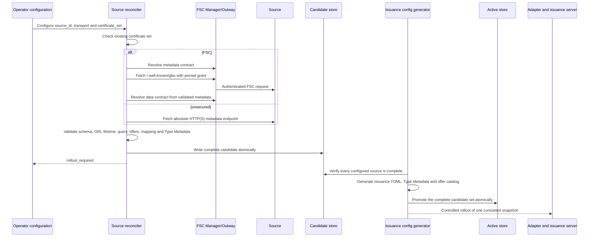

# Bronnen configureren en activeren

Een handmatig beheerd bestand in `sources/configured/` is de enige trigger om
een bron te onboarden. Een FSC-contract alleen maakt dus nooit een bron aan.
Iedere logische bron heeft een eigen `source_id` en verwijst naar een vooraf
beheerde issuer-, reader- en statuscertificaatset. De reconciler mint of
vernieuwt geen certificaten.

De bron blijft eigenaar van `/.well-known/gbo`. Dat document bevat per type de
GraphQL-query, parameters, concrete walletaanbiedingen, mapping en Type
Metadata. GBO bevat geen bron- of jaarcatalogus en de bron publiceert geen
GraphQL-schema.

## Transportprofielen

### FSC

```yaml
source_id: belastingdienst
source_oin: "99999999900000000200"
name: Belastingdienst
certificate_set: belastingdienst
metadata_endpoint:
  transport: fsc
  service_reference: gbo-metadata-bd
  path: /.well-known/gbo
data_access:
  transport: fsc
```

GBO resolveert zowel het geconfigureerde metadatacontract als de dataservice
uit actuele FSC-contracten. De geconfigureerde OIN, de provider-OIN van beide
contracten en `source_oin` uit het brondocument moeten gelijk zijn. Grant-hashes
worden bij iedere reconciliation opnieuw vastgelegd.

Meerdere logische bronnen mogen hetzelfde FSC-OIN gebruiken. `source_id`, de
metadata-service en certificaatset blijven per bron uniek. De lokale
Belastingdienst- en RvIG-bronnen gebruiken dit model.

### Unsecured

De meegeleverde unsecured voorbeeldbron staat bewust in
`sources/local-demo/`. Alleen de lokale Docker Compose-configuratie monteert
dit bestand. Simulatie- en productieconfiguraties gebruiken uitsluitend
`sources/configured/` en bieden deze bron dus niet aan.

```yaml
source_id: demo-unsecured
source_oin: "99999999900000000900"
name: Demo unsecured source
certificate_set: demo-unsecured
metadata_endpoint:
  transport: unsecured
  endpoint: http://unsecured-graphql-server:4000/.well-known/gbo
data_access:
  transport: unsecured
```

`unsecured` accepteert absolute HTTP- en HTTPS-endpoints. GBO stuurt geen
FSC-headers en volgt geen redirects. De OIN in het document moet nog steeds
overeenkomen met de handmatige configuratie, maar de transportlaag
authenticeert die identiteit niet. De status bevat daarom altijd
`transport_authenticated: false`.

Dit profiel is bedoeld voor demonstraties of afgeschermde netwerken. HTTPS
maakt het profiel niet brongebonden: zonder apart vastgelegde client- of
serveridentiteit blijft het `unsecured`. Autorisatie van het dataverzoek blijft
de verantwoordelijkheid van het gepubliceerde bronendpoint.

## Proces



De reconciler draait bij startup, daarna periodiek met `--watch`, of eenmalig
met `reconcile-sources --once`. In watch-modus worden de configuratiebestanden
bij iedere cyclus opnieuw gelezen. `ETag`/`If-None-Match`, monotone versies,
immutable bytes, freshness en stale grace worden door de reconciler bewaakt;
de HTTP-issuance-runtime haalt zelf nooit bronmetadata op.

Per bron staat de actuele toestand in
`.local/onboarding/status/<source_id>.json`:

- `pending`: de controle is gestart;
- `rollout_required`: een complete kandidaat wacht op configgeneratie;
- `active`: kandidaat en uitgerolde snapshot zijn gelijk;
- `stale`: ophalen of valideren faalt, maar de vorige snapshot zit nog binnen
  stale grace;
- `blocked`: er is geen bruikbare snapshot of stale grace is verstreken.

Een fout bij één bron blokkeert andere bronnen niet. `make eudi-config` faalt
wel wanneer een handmatig geconfigureerde bron `pending`, `stale` of `blocked`
is; een bron kan daardoor niet stil uit de walletproducten verdwijnen.

## Wat staat waar?

| Gegeven | Eigenaar/bron |
|---|---|
| `source_id`, verwachte OIN, naam, certset en metadata-endpoint | GBO-bronconfiguratie |
| FSC provider, services en grant-hashes | actuele FSC-contracten |
| GraphQL-endpoint, query, parameters, offers en mapping | `/.well-known/gbo` van de bron |
| Kaartnaam, kleur, kaartlogo, claimlabels en claimschema | Type Metadata in het brondocument |
| Getoonde issuernaam en issuerlogo | vooraf beheerde issuer-/readercertificaten |
| Immutable Type Metadata en kandidaat-/actiefsnapshot | GBO-onboardingopslag |
| Issuance-producten en QR-keuzelijst | mechanisch gegenereerd uit alle kandidaten |
| Private keys en certificaten | bevoegde certificaatbeheerder/secretopslag |

De maximale mappingfunctionaliteit staat in
[`gbo-simple-v1.md`](gbo-simple-v1.md). Onbekende functies en velden worden
geweigerd. Source-owned resolvers met domeinselectie blijven security-sensitive
broncode en moeten fail-closed regressietests hebben.

## Lokaal

Plaats voor een echte testwallet eerst de reeds vertrouwde ontwikkel-CA's in
`.local/secrets/development-ca/`; zie de [Quick start](../README.md#quick-start).
Daarna voert dit target de volledige onboarding uit:

```sh
make onboard-demo-sources
make eudi-config
```

Het eerste target start de drie bronnen, maakt de FSC-contracten, maakt
expliciet lokale leafcertificaten voor `belastingdienst`, `rvig` en
`demo-unsecured`, en draait één reconciliation. Het tweede target genereert de
walletproducten en promoveert alle kandidaten naar `active`.

## Productie

Gebruik hetzelfde adapterimage voor twee afzonderlijke workloads:

- één reconciler-Deployment met `reconcile-sources --watch` en één replica, of
  een CronJob met `--once`;
- de stateless HTTP-adapter die alleen de uitgerolde `active/`-snapshot leest.

Beide gebruiken dezelfde duurzame onboardingopslag. Voorbeeldwaarden staan in
[`source-reconciler-values.yaml`](../deploy/helm/gbo-app/examples/source-reconciler-values.yaml)
en [`eudi-adapter-values.yaml`](../deploy/helm/gbo-app/examples/eudi-adapter-values.yaml).
Certificaatprovisioning blijft een afzonderlijk, bevoegd beheerproces.
