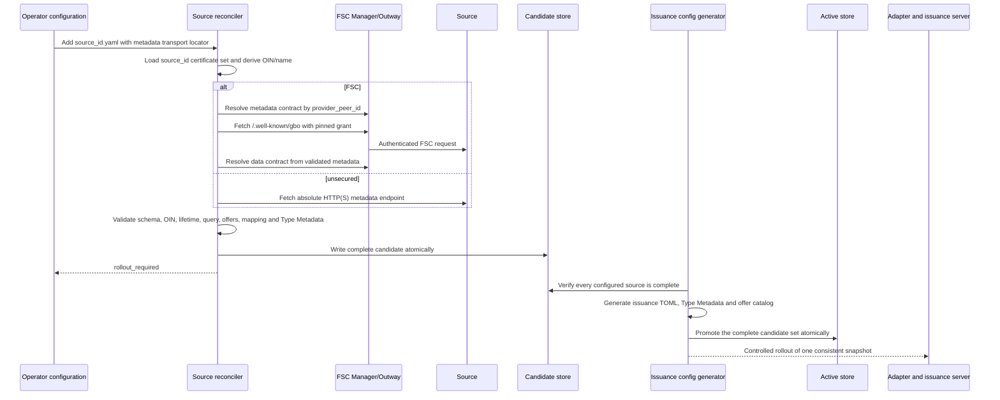

# Bronnen configureren en activeren

Een handmatig beheerd bestand in `sources/configured/` is de enige trigger om
een bron te onboarden. Een FSC-contract alleen maakt dus nooit een bron aan.
De bestandsnaam zonder extensie is de stabiele `source_id`: zo wordt
`belastingdienst.yaml` de bron `belastingdienst`. Iedere logische bron verwijst naar een vooraf
beheerde issuer-, reader- en statuscertificaatset met dezelfde sleutel als de
`source_id`. De reconciler leest de juridische OIN en organisatienaam uit die
certificaten; dezelfde waarden staan daarom niet nogmaals in de bronconfig. De
reconciler mint of vernieuwt geen certificaten.

De bron blijft eigenaar van `/.well-known/gbo`. Dat document bevat per type de
GraphQL-query, parameters, concrete walletaanbiedingen, mapping en Type
Metadata. GBO bevat geen bron- of jaarcatalogus en de bron publiceert geen
GraphQL-schema.

## Waarom valideren en activeren twee stappen zijn

Een geldige bron wordt niet automatisch gebruikt voor walletuitgifte. De
bronmetadata bepaalt namelijk welke gegevens worden opgehaald, hoe die naar
claims worden vertaald, wat de wallet toont en welke certificaten de
issuance-server gebruikt. Een bronhouder mag die operationele uitgifte niet
eenzijdig en onmiddellijk kunnen wijzigen.

Onboarding bestaat daarom uit twee expliciete fasen:

1. **Reconciliation** haalt de bronmetadata op en controleert identiteit,
   transport, FSC-contracten, schema, mapping, geldigheid en certificaten. Het
   resultaat is een complete maar nog niet actieve kandidaat met status
   `rollout_required`.
2. **Promotie** maakt uit één gevalideerde kandidaatset alle runtimeproducten
   en activeert die als één consistente release.

De promotie levert vier samenhangende producten op:

| Product | Gebruikt door | Functie |
| --- | --- | --- |
| Actieve bronsnapshot | EUDI-adapter | Bron, query, mapping, FSC-grant en geldigheidsvenster |
| Immutable Type Metadata | Wallet via EUDI-adapter | VCT, claimschema en walletpresentatie |
| `issuance_server.toml` | nl-wallet issuance-server | Offers, disclosure, certificaten en trust anchors |
| `eudi-offers.json` | Developer-portal en landingspagina | De uitgiftekeuzes die een gebruiker kan starten |

Deze producten moeten uit exact dezelfde kandidaatset komen. Een gedeeltelijke
uitrol kan bijvoorbeeld een offer tonen waarvoor de issuance-server nog geen
configuratie heeft, of een credential uitgeven waarvan de publieke Type
Metadata ontbreekt. De issuance-server herlaadt zijn productconfiguratie niet
dynamisch; een promotie vereist daarom altijd een gecontroleerde rollout.

In een wegwerpbare demo mag de expliciete goedkeuring worden overgeslagen met
`reconcile-sources --auto-promote`. De reconciler genereert en promoveert dan
na een volledig succesvolle reconciliation automatisch. Dit verandert niets
aan de technische noodzaak om de issuance-server en andere consumers van de
gegenereerde producten te herstarten. De optie staat standaard uit en hoort
niet in een productieomgeving.

## Transportprofielen

### FSC

```yaml
metadata_endpoint:
  transport: fsc
  provider_peer_id: "0000009958MINBZK0000"
  service_reference: gbo-metadata-bd
```

GBO resolveert zowel het geconfigureerde metadatacontract als de dataservice
uit actuele FSC-contracten. `provider_peer_id` selecteert de FSC-provider van
beide contracten en mag exact twintig alfanumerieke tekens bevatten. Het vaste
pad `/.well-known/gbo`, het datatransport en grant-hashes worden automatisch
ingevuld. De twintigcijferige juridische OIN en organisatienaam komen uit de
vooraf beheerde certificaatset en moeten overeenkomen met het brondocument.

Meerdere logische bronnen mogen hetzelfde FSC-Peer ID gebruiken. `source_id`, de
metadata-service en gelijknamige certificaatset blijven per bron uniek. De lokale
Belastingdienst- en RvIG-bronnen gebruiken dit model.

### Unsecured

De meegeleverde unsecured voorbeeldbron staat bewust in
`sources/local-demo/`. Alleen de lokale Docker Compose-configuratie monteert
dit bestand. Simulatie- en productieconfiguraties gebruiken uitsluitend
`sources/configured/` en bieden deze bron dus niet aan.

```yaml
metadata_endpoint:
  transport: unsecured
  endpoint: http://unsecured-graphql-server:4000/.well-known/gbo
```

`unsecured` accepteert absolute HTTP- en HTTPS-endpoints. GBO stuurt geen
FSC-headers en volgt geen redirects. De OIN in het document moet nog steeds
overeenkomen met het vooraf beheerde certificaat, maar de transportlaag
authenticeert die identiteit niet. De status bevat daarom altijd
`transport_authenticated: false`.

Dit profiel is bedoeld voor demonstraties of afgeschermde netwerken. HTTPS
maakt het profiel niet brongebonden: zonder apart vastgelegde client- of
serveridentiteit blijft het `unsecured`. Autorisatie van het dataverzoek blijft
de verantwoordelijkheid van het gepubliceerde bronendpoint.

## Proces



De reconciler draait bij startup, daarna periodiek met `--watch`, of eenmalig
met `reconcile-sources --once`. In watch-modus worden de configuratiebestanden
bij iedere cyclus opnieuw gelezen. `ETag`/`If-None-Match`, monotone versies,
immutable bytes, freshness en stale grace worden door de reconciler bewaakt;
de HTTP-issuance-runtime haalt zelf nooit bronmetadata op.

Per bron staat de actuele toestand in
`.local/onboarding/status/<source_id>.json`:

- `pending`: de controle is gestart;
- `rollout_required`: een complete kandidaat wacht op configgeneratie;
- `active`: kandidaat en uitgerolde snapshot zijn gelijk;
- `stale`: ophalen of valideren faalt, maar de vorige snapshot zit nog binnen
  stale grace;
- `blocked`: er is geen bruikbare snapshot of stale grace is verstreken.

Deze toestand is applicatiestatus en geen Kubernetes `Condition`. In een
Kubernetes-deployment staat dezelfde JSON op de duurzame onboardingopslag,
bijvoorbeeld onder `/state/status/<source_id>.json` in de reconcilerpod. Een
gezonde reconcilerpod kan dus `Ready` zijn terwijl een bron terecht
`rollout_required` of `blocked` is. Het deploymentrunbook moet beide niveaus
controleren.

Een fout bij één bron blokkeert reconciliation van andere bronnen niet. De
handmatige generator behoudt bij `pending` of `stale` een nog bruikbare actieve
snapshot en laat een `blocked` bron zonder fallback weg; hij faalt als geen
enkele bron inzetbaar is. Demo-auto-promotie is strenger en draait alleen als
de volledige reconciliation zonder bronfouten is afgerond.

## Wat staat waar?

| Gegeven | Eigenaar/bron |
|---|---|
| `source_id` | Bestandsnaam van de GBO-bronconfiguratie |
| Transport en metadata-locator | Inhoud van de GBO-bronconfiguratie |
| Juridische `source_oin`, organisatienaam en certificatenset | Vooraf beheerde certificaten onder de sleutel `source_id` |
| FSC provider Peer ID, services en grant-hashes | actuele FSC-contracten |
| GraphQL-endpoint, query, parameters, offers en mapping | `/.well-known/gbo` van de bron |
| Kaartnaam, kleur, kaartlogo, claimlabels en claimschema | Type Metadata in het brondocument |
| Getoonde issuernaam en issuerlogo | vooraf beheerde issuer-/readercertificaten |
| Immutable Type Metadata en kandidaat-/actiefsnapshot | GBO-onboardingopslag |
| Issuance-producten en QR-keuzelijst | mechanisch gegenereerd uit alle kandidaten |
| Private keys en certificaten | bevoegde certificaatbeheerder/secretopslag |

De maximale mappingfunctionaliteit staat in
[`gbo-simple-v1.md`](gbo-simple-v1.md). Onbekende functies en velden worden
geweigerd. Source-owned resolvers met domeinselectie blijven security-sensitive
broncode en moeten fail-closed regressietests hebben.

## Lokaal

Plaats voor een echte testwallet eerst de reeds vertrouwde ontwikkel-CA's in
`.local/secrets/development-ca/`, of zet `ONBOARDING_SECRETS_DIR` op een
beheerde secrets-root met de submap `development-ca/`; zie de
[Quick start](../README.md#quick-start). Onboarding genereert uitsluitend
brongebonden leafcertificaten. De issuer- en reader-CA worden nooit gegenereerd
en ontbrekende CA-bestanden laten de setup direct stoppen.
Daarna voert dit target de volledige onboarding uit:

```sh
make onboard-demo-sources
make eudi-config
```

Het eerste target start de drie bronnen, maakt de FSC-contracten, maakt
expliciet lokale leafcertificaten voor `belastingdienst`, `rvig` en
`demo-unsecured`, en draait één reconciliation. Het tweede target genereert de
walletproducten en promoveert alle kandidaten naar `active`.

## Productie

Gebruik hetzelfde adapterimage voor twee afzonderlijke workloads:

- één reconciler-Deployment met `reconcile-sources --watch` en één replica, of
  een CronJob met `--once`;
- de stateless HTTP-adapter die alleen de uitgerolde `active/`-snapshot leest.

Beide gebruiken dezelfde duurzame onboardingopslag. Voorbeeldwaarden staan in
[`source-reconciler-values.yaml`](../deploy/helm/gbo-app/examples/source-reconciler-values.yaml)
en [`eudi-adapter-values.yaml`](../deploy/helm/gbo-app/examples/eudi-adapter-values.yaml).
De reconciler blijft daarin ook na promotie het geldigheidsvenster van een
ongewijzigde actieve snapshot verversen. Kopieer een `active/`-bestand daarom
niet naar statische image-inhoud: zonder die refresh loopt de runtime na de
stale grace bewust dicht.

Voer een eerste Kubernetes-activatie bij voorkeur in twee gecontroleerde
stappen uit. Laat eerst een eenmalige generator-Job de complete kandidaatset op
de duurzame opslag promoveren en controleer dat alle statussen `active` zijn.
Rol daarna pas de adapter, issuance-server en frontendproducten uit. Daarmee
kan de adapter niet vóór de promotie gezond starten met een lege snapshot. Een
latere metadatawijziging volgt dezelfde expliciete goedkeuringsgrens.

Voor een demo kan dezelfde reconciler automatisch promoveren:

```text
reconcile-sources --watch --auto-promote \
  --issuance-template=/runtime-template/issuance_server.toml.example \
  --issuance-output=/runtime/issuance_server.toml \
  --offers-output=/runtime/eudi-offers.json
```

`/runtime` moet duurzame, gedeelde opslag zijn. Laat een deployment-specifieke
rolloutcontroller de issuance-server, adapter en frontend opnieuw starten als
de gegenereerde revisie verandert. Auto-promotie geeft de reconciler bewust
geen Kubernetes-APIrechten en verwijdert dus niet zelf pods.

Certificaatprovisioning blijft een afzonderlijk, bevoegd beheerproces. Alleen
dat proces heeft de CA-private keys nodig. De reconciler-runtime krijgt de
issuer-, reader- en status-leaf keys/certificaten plus de publieke issuer- en
reader-CA-certificaten; CA-private keys horen niet in het runtime Secret.

### Upgrade vanaf v0.6.1

De scheiding tussen FSC-identiteit en juridische bronidentiteit wijzigt enkele
deploymentcontracten bewust fail-closed:

- iedere FSC-bronconfiguratie krijgt `metadata_endpoint.provider_peer_id`; de
  bestandsnaam vervangt het vroegere `source_id`-veld;
  `source_oin`, naam, certset, metadata-path en `data_access` verdwijnen uit
  deze configuratie en worden uit certificaten, vaste conventies, metadata en
  actuele contracten afgeleid;
- de reconciler gebruikt `--consumer-peer-id` of
  `FSC_CONSUMER_PEER_ID`; `--consumer-oin` en `ISSUER_OIN` vervallen;
- het DvTP-register krijgt een JSON-configuratie via
  `ONBOARDING_CONFIG_PATH`, met `source_holders`, `system_participants` en
  optionele `seed_participants`;
- de OpenFTV PIP-feed gebruikt `peer_id` en `allowed_source_peer_ids`.

Rol eerst de DvTP-configuratie en de nieuwe register-/PDP-images samen uit.
Laat daarna de source reconciler ten minste één succesvolle ronde uitvoeren
voordat de HTTP-adapter als functioneel wordt beschouwd; zo worden bestaande
activaties aangevuld met `provider_peer_id`. De runtime kan zonder CA-private
keys starten zodra alle brongebonden leafbestanden en beide publieke
CA-certificaten aanwezig zijn.

Voor Kubernetes staan voorbeelden in
[`dvtp-onboarding-register-values.yaml`](../deploy/helm/gbo-app/examples/dvtp-onboarding-register-values.yaml),
[`dvtp-onboarding-configmap.yaml`](../deploy/helm/gbo-app/examples/dvtp-onboarding-configmap.yaml),
[`source-reconciler-values.yaml`](../deploy/helm/gbo-app/examples/source-reconciler-values.yaml)
en [`eudi-adapter-values.yaml`](../deploy/helm/gbo-app/examples/eudi-adapter-values.yaml).
