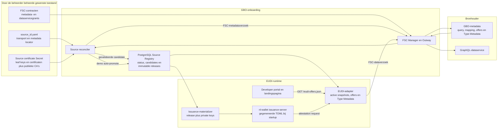
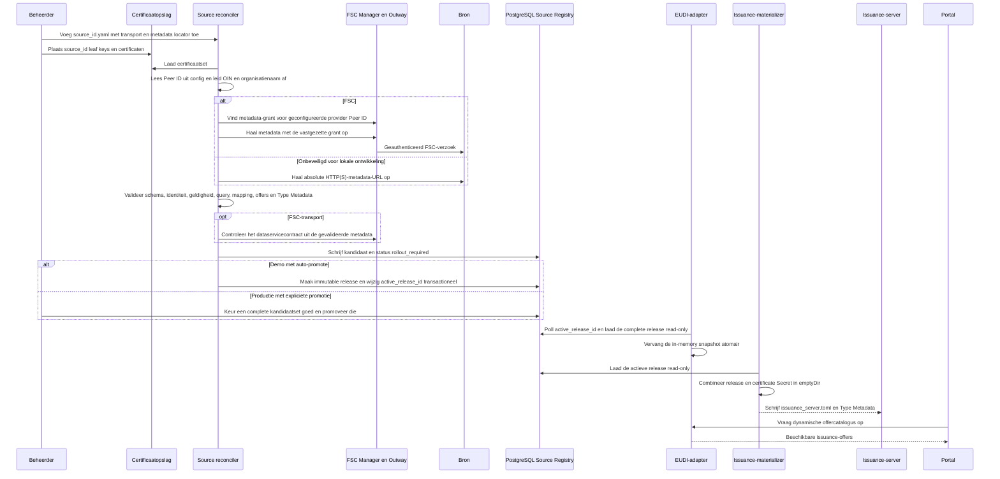

# Bronnen configureren en activeren

Een handmatig beheerd bestand in `sources/configured/` is de enige trigger om
een bron te onboarden. Een FSC-contract alleen maakt dus nooit een bron aan.
De bestandsnaam zonder extensie is de stabiele `source_id`: zo wordt
`belastingdienst.yaml` de bron `belastingdienst`. Iedere logische bron verwijst
naar een vooraf beheerde issuer-, reader- en statuscertificaatset met dezelfde
sleutel als de `source_id`. De reconciler leest de juridische OIN en
organisatienaam uit die certificaten; dezelfde waarden staan daarom niet
nogmaals in de bronconfig. De reconciler mint of vernieuwt geen certificaten.

De bron blijft eigenaar van `/.well-known/gbo`. Dat document bevat per type de
GraphQL-query, parameters, concrete walletaanbiedingen, mapping en Type
Metadata. GBO bevat geen bron- of jaarcatalogus en de bron publiceert geen
GraphQL-schema.

## Architectuur

De onboardingconfiguratie beschrijft alleen **waar** de metadata gevonden kan
worden en **hoe** deze wordt opgehaald. De certificaten leveren de identiteit,
de FSC-contracten geven toegang en de metadata van de bron beschrijft het
inhoudelijke product. Na validatie maakt de reconciler daar runtimeconfiguratie
voor de EUDI-componenten van.



De reconciler krijgt bewust geen Kubernetes-APIrechten. Certificaten en
contracten worden vooraf beheerd; de reconciler leest ze en schrijft uitsluitend
naar de Source Registry. De adapter leest de actieve release met een read-only
database-account. De issuance-materializer combineert diezelfde release met het
private-key-Secret in een tijdelijk runtimevolume. Een gecontroleerde restart
van de issuance-server blijft nodig wanneer de actieve release wijzigt.

## Waarom valideren en activeren twee stappen zijn

Een geldige bron wordt niet automatisch gebruikt voor walletuitgifte. De
bronmetadata bepaalt namelijk welke gegevens worden opgehaald, hoe die naar
claims worden vertaald, wat de wallet toont en welke certificaten de
issuance-server gebruikt. Een bronhouder mag die operationele uitgifte niet
eenzijdig en onmiddellijk kunnen wijzigen.

Onboarding bestaat daarom uit twee expliciete fasen:

1. **Reconciliation** haalt de bronmetadata op en controleert identiteit,
   transport, FSC-contracten, schema, mapping, geldigheid en certificaten. Het
   resultaat is een complete maar nog niet actieve kandidaat met status
   `rollout_required`.
2. **Promotie** maakt uit één gevalideerde kandidaatset alle runtimeproducten
   en activeert die als één consistente release.

De promotie levert vier samenhangende producten op:

| Product | Gebruikt door | Functie |
| --- | --- | --- |
| Actieve bronsnapshot | EUDI-adapter | Bron, query, mapping, FSC-grant en geldigheidsvenster |
| Immutable Type Metadata | Wallet via EUDI-adapter | VCT, claimschema en walletpresentatie |
| `issuance_server.toml` | nl-wallet issuance-server | Offers, disclosure, certificaten en trust anchors |
| `eudi-offers.json` | Developer-portal en landingspagina | De uitgiftekeuzes die een gebruiker kan starten |

Deze producten moeten uit exact dezelfde kandidaatset komen. Een gedeeltelijke
uitrol kan bijvoorbeeld een offer tonen waarvoor de issuance-server nog geen
configuratie heeft, of een credential uitgeven waarvan de publieke Type
Metadata ontbreekt. De issuance-server herlaadt zijn productconfiguratie niet
dynamisch; een promotie vereist daarom altijd een gecontroleerde rollout.

In een wegwerpbare demo mag de expliciete goedkeuring worden overgeslagen met
`reconcile-sources --auto-promote`. De reconciler genereert en promoveert dan
na een volledig succesvolle reconciliation automatisch. Dit verandert niets
aan de technische noodzaak om de issuance-server na een gewijzigde TOML te
herstarten. De optie staat standaard uit en hoort niet in een
productieomgeving.

## Transportprofielen

### FSC

```yaml
metadata_endpoint:
  transport: fsc
  provider_peer_id: "0000009958MINBZK0000"
  service_reference: gbo-metadata-bd
```

GBO resolveert zowel het geconfigureerde metadatacontract als de dataservice
uit actuele FSC-contracten. `provider_peer_id` selecteert de FSC-provider van
beide contracten en mag exact twintig alfanumerieke tekens bevatten. Het vaste
pad `/.well-known/gbo`, het datatransport en grant-hashes worden automatisch
ingevuld. De twintigcijferige juridische OIN en organisatienaam komen uit de
vooraf beheerde certificaatset en moeten overeenkomen met het brondocument.

Meerdere logische bronnen mogen hetzelfde FSC-Peer ID gebruiken. `source_id`, de
metadata-service en gelijknamige certificaatset blijven per bron uniek. De lokale
Belastingdienst- en RvIG-bronnen gebruiken dit model.

### Unsecured

De meegeleverde unsecured voorbeeldbron staat bewust in
`sources/local-demo/`. Alleen de lokale Docker Compose-configuratie monteert
dit bestand. Simulatie- en productieconfiguraties gebruiken uitsluitend
`sources/configured/` en bieden deze bron dus niet aan.

```yaml
metadata_endpoint:
  transport: unsecured
  endpoint: http://unsecured-graphql-server:4000/.well-known/gbo
```

`unsecured` accepteert absolute HTTP- en HTTPS-endpoints. GBO stuurt geen
FSC-headers en volgt geen redirects. De OIN in het document moet nog steeds
overeenkomen met het vooraf beheerde certificaat, maar de transportlaag
authenticeert die identiteit niet. De status bevat daarom altijd
`transport_authenticated: false`.

Dit profiel is bedoeld voor demonstraties of afgeschermde netwerken. HTTPS
maakt het profiel niet brongebonden: zonder apart vastgelegde client- of
serveridentiteit blijft het `unsecured`. Autorisatie van het dataverzoek blijft
de verantwoordelijkheid van het gepubliceerde bronendpoint.

## Proces



Een promotie schrijft eerst een immutable release en wijzigt daarna binnen
dezelfde databasetransactie de singleton `active_release_id`. De adapter pollt
de pointer en vervangt zijn complete in-memory snapshot atomair; ook volledig
nieuwe bronnen worden zo zichtbaar zonder restart. De issuance-server leest
zijn TOML alleen bij het opstarten, dus die pod of container moet na promotie
wel gecontroleerd worden herstart. De frontends halen de offercatalogus
dynamisch bij de adapter op en hoeven niet te herstarten.

De reconciler draait bij startup, daarna periodiek met `--watch`, of eenmalig
met `reconcile-sources --once`. In watch-modus worden de configuratiebestanden
bij iedere cyclus opnieuw gelezen. `ETag`/`If-None-Match`, monotone versies,
immutable bytes, freshness en stale grace worden door de reconciler bewaakt;
de HTTP-issuance-runtime haalt zelf nooit bronmetadata op.

Per bron staat de actuele toestand duurzaam in de Source Registry:

- `pending`: de controle is gestart;
- `rollout_required`: een complete kandidaat wacht op configgeneratie;
- `active`: kandidaat en uitgerolde snapshot zijn gelijk;
- `stale`: ophalen of valideren faalt, maar de vorige snapshot zit nog binnen
  stale grace;
- `blocked`: er is geen bruikbare snapshot of stale grace is verstreken.

Deze toestand is applicatiestatus en geen Kubernetes `Condition`. Een gezonde
reconcilerpod kan dus `Ready` zijn terwijl een bron terecht `rollout_required`
of `blocked` is. Het deploymentrunbook moet beide niveaus controleren.

Een fout bij één bron beschadigt kandidaten van andere bronnen en de bestaande
actieve release niet. Promotie van een nieuwe complete release faalt wel wanneer
een handmatig geconfigureerde bron `pending`, `stale` of `blocked` is; een bron
kan daardoor niet stil uit de walletproducten verdwijnen.

## Wat staat waar?

| Gegeven | Eigenaar/bron |
|---|---|
| `source_id` | Bestandsnaam van de GBO-bronconfiguratie |
| Transport en metadata-locator | Inhoud van de GBO-bronconfiguratie |
| Juridische `source_oin`, organisatienaam en certificatenset | Vooraf beheerde certificaten onder de sleutel `source_id` |
| FSC provider Peer ID, services en grant-hashes | actuele FSC-contracten |
| GraphQL-endpoint, query, parameters, offers en mapping | `/.well-known/gbo` van de bron |
| Kaartnaam, kleur, kaartlogo, claimlabels en claimschema | Type Metadata in het brondocument |
| Getoonde issuernaam en issuerlogo | vooraf beheerde issuer-/readercertificaten |
| Kandidaten, statussen, immutable releases, Type Metadata en publieke offercatalogus | PostgreSQL Source Release Registry |
| Actieve release | transactionele singleton `active_release_id` |
| Private keys | Kubernetes Secret of lokale secretopslag; uitsluitend gemount in de issuance-materializer |
| Publieke certificaatidentiteit en SHA-256-digest | Source Release Registry |

De maximale mappingfunctionaliteit staat in
[`gbo-simple-v1.md`](gbo-simple-v1.md). Onbekende functies en velden worden
geweigerd. Source-owned resolvers met domeinselectie blijven security-sensitive
broncode en moeten fail-closed regressietests hebben.

## Lokaal

Plaats voor een echte testwallet eerst de reeds vertrouwde ontwikkel-CA's in
`.local/secrets/development-ca/`, of zet `ONBOARDING_SECRETS_DIR` op een
beheerde secrets-root met de submap `development-ca/`; zie de
[Quick start](../README.md#quick-start). Onboarding genereert uitsluitend
brongebonden leafcertificaten. De issuer- en reader-CA worden nooit gegenereerd
en ontbrekende CA-bestanden laten de setup direct stoppen.
Daarna voert dit target de volledige onboarding uit:

```sh
make onboard-demo-sources
make demo-eudi
```

Het eerste target start de drie bronnen, maakt de FSC-contracten, maakt
expliciet lokale leafcertificaten voor `belastingdienst`, `rvig` en
`demo-unsecured`, draait één reconciliation en promoveert de complete release
atomair. `demo-eudi` materialiseert de release in een lokale runtimevolume en
start daarna de issuance-server. Na een latere metadatawijziging voert
`make eudi-config` de vereiste rematerialisatie en restart uit.

### Inspectie en rollback

Inspecteer uitsluitend de niet-geheime identiteit, versies en freshness van
de actieve release:

```sh
docker compose --profile onboarding run --rm source-reconciler \
  ./eudi-adapter inspect-source-registry
```

Een eerdere immutable release blijft in PostgreSQL beschikbaar. Activeer die
atomair met het writer-account door het release-ID uit de inspectie of de
operationele historie expliciet op te geven:

```sh
docker compose --profile onboarding run --rm source-reconciler \
  ./eudi-adapter activate-source-release --release-id=<sha256-release-id>
```

De adapter neemt de complete release bij zijn volgende refresh over. Draai
daarna `make eudi-config` om de issuance-configuratie uit dezelfde release te
rematerialiseren en de issuance-server te herstarten. In Kubernetes gebeurt
dit door de issuance-pod opnieuw aan te maken, zodat de init-container opnieuw
draait. Een onbekend release-ID wijzigt de actieve pointer niet.

## Productie

Gebruik hetzelfde adapterimage voor drie afzonderlijke rollen:

- één reconciler-Deployment met `reconcile-sources --watch --migrate`, één
  replica en het registry writer-account, of
  een CronJob met `--once`;
- de stateless HTTP-adapter met een read-only registry-account;
- een issuance init-container met een read-only registry-account, het
  certificaat-Secret en een schrijfbare runtime-`emptyDir`.

De rollen gebruiken dezelfde applicatie-eigen Source Registry, maar met
least-privilege credentials. Voorbeeldwaarden staan in
[`source-reconciler-values.yaml`](../deploy/helm/gbo-app/examples/source-reconciler-values.yaml)
en [`eudi-adapter-values.yaml`](../deploy/helm/gbo-app/examples/eudi-adapter-values.yaml).

Voer een eerste Kubernetes-activatie bij voorkeur in twee gecontroleerde
stappen uit. Laat eerst een eenmalige reconciler-Job de complete kandidaatset
naar de registry promoveren en controleer dat alle statussen `active` zijn.
Rol daarna pas de adapter en issuance-server uit. Daarmee kan de adapter niet
vóór de promotie gezond starten met een lege release. Een latere
metadatawijziging volgt dezelfde expliciete goedkeuringsgrens.

Voor een demo kan dezelfde reconciler automatisch promoveren:

```text
reconcile-sources --watch --auto-promote --storage-backend=postgres
```

Auto-promotie geeft de reconciler bewust geen Kubernetes-APIrechten en
verwijdert dus niet zelf pods. De beheerder of deploymentautomatisering moet de
issuance-server gecontroleerd herstarten nadat de actieve release verandert.
De adapter neemt zowel gewijzigde als volledig nieuwe bronnen dynamisch over;
de frontends lezen de offercatalogus eveneens dynamisch.

Certificaatprovisioning blijft een afzonderlijk, bevoegd beheerproces. Alleen
dat proces heeft de CA-private keys nodig. De reconciler krijgt via een Secret-
projectie uitsluitend publieke issuer-, reader- en statusleafs plus publieke
CA-certificaten. Alleen de issuance init-container krijgt de bijbehorende
leaf-private keys.

`--migrate` past versioned migrations toe onder een PostgreSQL advisory lock.
Geef daarbij `--database-reader-role=<rol>` mee om alleen `SELECT` op immutable
release-tabellen en de actieve pointer te verlenen; candidates en statuses
blijven voor dat runtime-account onzichtbaar. De database en beide rollen zelf
worden door het platform geprovisioneerd.

Gebruik `inspect-source-registry` met het reader-account voor diagnose. Maak
voor `activate-source-release` een korte beheer-Job met het writer-account;
geef het release-ID expliciet mee en verwijder de Job na afloop. Geef deze
beheeroperatie niet aan de stateless adapter of de issuance-server.

### Upgrade vanaf v0.6.1

De scheiding tussen FSC-identiteit en juridische bronidentiteit wijzigt enkele
deploymentcontracten bewust fail-closed:

- iedere FSC-bronconfiguratie krijgt `metadata_endpoint.provider_peer_id`; de
  bestandsnaam vervangt het vroegere `source_id`-veld;
  `source_oin`, naam, certset, metadata-path en `data_access` verdwijnen uit
  deze configuratie en worden uit certificaten, vaste conventies, metadata en
  actuele contracten afgeleid;
- de reconciler gebruikt `--consumer-peer-id` of
  `FSC_CONSUMER_PEER_ID`; `--consumer-oin` en `ISSUER_OIN` vervallen;
- het DvTP-register krijgt een JSON-configuratie via
  `ONBOARDING_CONFIG_PATH`, met `source_holders`, `system_participants` en
  optionele `seed_participants`;
- de OpenFTV PIP-feed gebruikt `peer_id` en `allowed_source_peer_ids`.

Rol eerst de DvTP-configuratie en de nieuwe register-/PDP-images samen uit.
Laat daarna de source reconciler ten minste één succesvolle ronde uitvoeren
voordat de HTTP-adapter als functioneel wordt beschouwd; zo worden bestaande
activaties aangevuld met `provider_peer_id`. De runtime kan zonder CA-private
keys starten zodra alle brongebonden leafbestanden en beide publieke
CA-certificaten aanwezig zijn.

Voor Kubernetes staan voorbeelden in
[`dvtp-onboarding-register-values.yaml`](../deploy/helm/gbo-app/examples/dvtp-onboarding-register-values.yaml),
[`dvtp-onboarding-configmap.yaml`](../deploy/helm/gbo-app/examples/dvtp-onboarding-configmap.yaml),
[`source-reconciler-values.yaml`](../deploy/helm/gbo-app/examples/source-reconciler-values.yaml)
en [`eudi-adapter-values.yaml`](../deploy/helm/gbo-app/examples/eudi-adapter-values.yaml).
