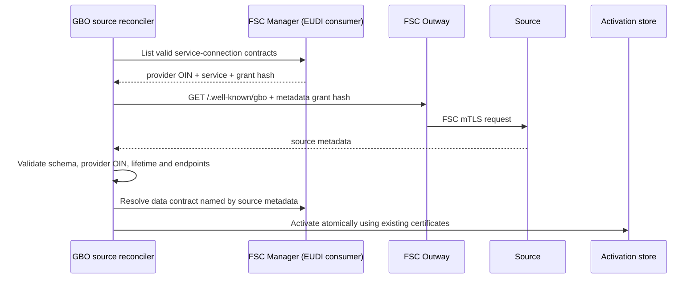

# Bronnen ontdekken en activeren

GBO configureert geen bronquery of mapping. Een bron publiceert één generiek
document op `/.well-known/gbo`. De EUDI-capability daarin bevat per type de
GraphQL-service, query, parameters, mapping en wallet Type Metadata. Later kan
hetzelfde document naast `capabilities.eudi` bijvoorbeeld `capabilities.oots`
bevatten.

## FSC: geen onboardingbestand

Voor een FSC-bron zijn twee geldige service-connection-contracten nodig:

- `gbo-metadata`, om het vaste `/.well-known/gbo`-document op te halen;
- de dataservice die het brondocument zelf noemt, bijvoorbeeld `bri` of `brp`.

De reconciler leest de contracten uit de FSC Manager van de EUDI-adapterpeer.
Per contract gebruikt hij de provider-OIN, servicenaam en grant-hash. Daardoor
staan bron-OIN, FSC-servicebindingen en grant-hashes niet ook nog in Git of in
losse onboarding-YAML.

De statische `validate-source`- en `onboard-source`-commando's weigeren daarom
het FSC-transport en verwijzen naar `reconcile-fsc-sources`.



De provider-OIN uit het metadata-document moet gelijk zijn aan de provider-OIN
in het FSC-contract. Metadata en data moeten voor diezelfde provider geldige
contracten hebben. De issuance-runtime leest alleen geactiveerde records en
stuurt bij ieder FSC-verzoek de gepinde grant-hash mee. Zonder geldig record of
bruikbaar contract faalt uitgifte gesloten; er is geen legacyfallback.

## Wat staat waar?

| Gegeven | Bron |
|---|---|
| Provider-OIN, transportbinding en grant-hash | geldig FSC-contract |
| Vast metadata-pad | GBO-profiel: `/.well-known/gbo` |
| Dataservicenaam, GraphQL-endpoint, query, parameters en mapping | bronmetadata |
| Kaartnaam, kleur, logo, claimlabels en claimschema | Type Metadata in de bronmetadata |
| Immutable Type Metadata en activatierecord | GBO-onboardingopslag |
| Issuer-, reader- en statuscertificaten en private keys | bevoegde certificaatbeheerder/secretopslag |

Een bron publiceert geen GraphQL-schema. De ondersteunde mappingfunctionaliteit
staat in [gbo-simple-v1.md](gbo-simple-v1.md); onbekende functies of velden
worden geweigerd.

## Lokaal

De volledige route voor de afzonderlijke BD- en BRP/RvIG-peers is:

```sh
make onboard-demo-sources
```

Deze target start de FSC-peers, publiceert en contracteert hun metadata- en
dataservices, maakt uitsluitend voor lokaal gebruik expliciet
ontwikkelcertificaten en draait daarna één reconciliatie. De kernstappen zijn:

```sh
make provision-development-certificates SOURCE_OIN=99999999900000000200
make provision-development-certificates SOURCE_OIN=99999999900000000400
make reconcile-fsc-sources
```

De reconciler mint of vernieuwt nooit certificaten. Ontbrekende, verlopen of
niet-passende certificaten blokkeren activatie. In productie worden die door
een apart bevoegd proces uitgegeven.

## Productie

De reconciler en issuance-runtime gebruiken hetzelfde image maar zijn aparte
processen. In Kubernetes draait de reconciler als Deployment met één replica
en `reconcile-fsc-sources --watch`, of als CronJob zonder `--watch`. De
HTTP-issuance-runtime pollt geen contracten en schrijft geen onboardingstaat.

Een bron buiten FSC kan later statisch worden geregistreerd met een absoluut
HTTPS-endpoint, zoals [example-https-mtls.yaml](../sources/example-https-mtls.yaml).
Dat transportprofiel is bewust nog fail-closed: activering wacht op een
vastgelegd PKI-profiel, brongebonden clientcertificaten, OIN-controle en
intrekkingsgedrag. FSC is dus een discoveryprovider, niet een verplichte kern
van het metadatamodel.
